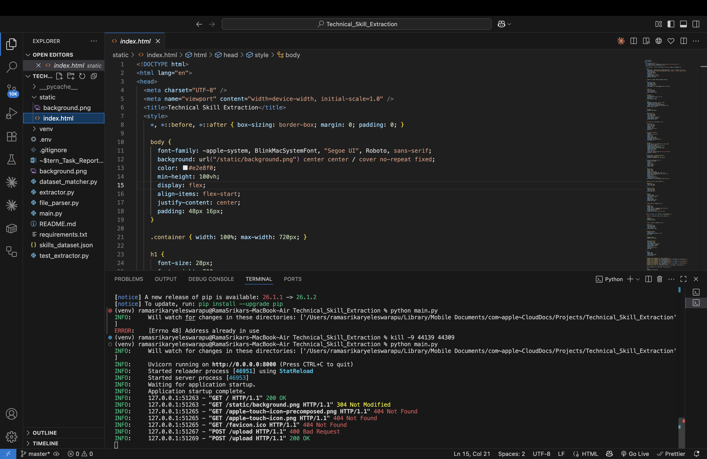
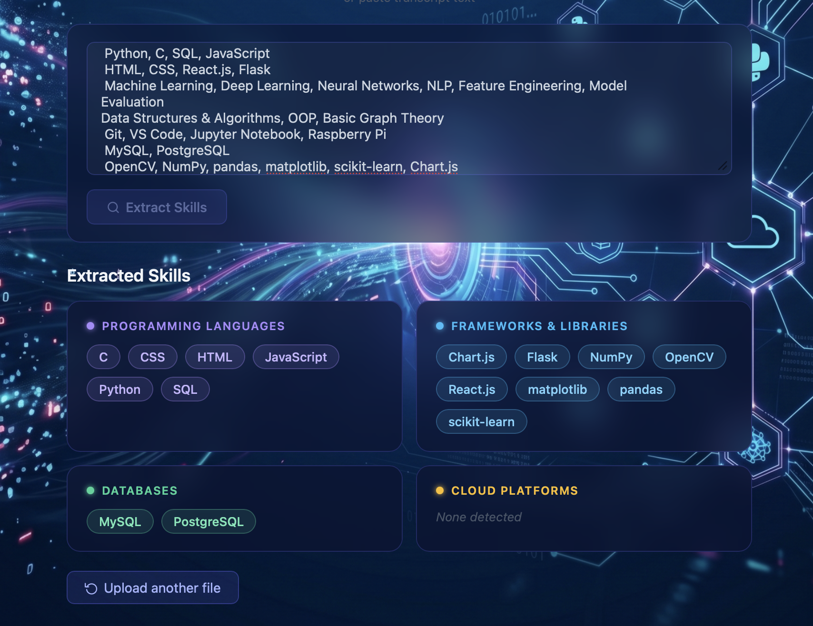

# Technical Skill Extraction

Extract technical skills from interview transcripts automatically. Upload a TXT, PDF, or DOCX file **or paste transcript text directly** and get a structured breakdown of the candidate's skills across four categories.

## Features

- Supports TXT, PDF, and DOCX file formats
- Extracts skills across four categories: Programming Languages, Frameworks & Libraries, Databases, Cloud Platforms
- Handles misspellings (e.g. `Pthon` → `Python`, `Reakt` → `React`)
- Normalizes aliases and abbreviations (e.g. `JS` → `JavaScript`, `k8s` → `Kubernetes`, `Postgres` → `PostgreSQL`)
- Hybrid extraction: dataset-based fuzzy matching + LLM for maximum coverage
- Clean web UI with drag-and-drop file upload or paste-text input

## Tech Stack

- **Backend**: FastAPI, Python
- **LLM**: Groq API (`llama-3.3-70b-versatile`)
- **Skill Matching**: rapidfuzz (fuzzy matching against a 250+ skill dataset)
- **File Parsing**: pypdf (PDF), python-docx (DOCX)
- **Frontend**: Vanilla HTML/CSS/JS

## Project Structure

```
Technical_Skill_Extraction/
├── main.py               # FastAPI app and endpoints
├── extractor.py          # Hybrid skill extraction (LLM + dataset)
├── dataset_matcher.py    # Dataset-based fuzzy matching logic
├── file_parser.py        # TXT / PDF / DOCX parsing
├── skills_dataset.json   # 250+ skills taxonomy with aliases
├── test_extractor.py     # Test cases
├── static/
│   └── index.html        # Web UI
├── .env                  # API keys (not committed)
├── .gitignore
└── requirements.txt
```

## Setup

**1. Clone the repository and navigate to the project folder**

```bash
git clone <repo-url>
cd Technical_Skill_Extraction
```

**2. Install dependencies**

```bash
pip install -r requirements.txt
```

**3. Configure environment variables**

Create a `.env` file in the project root:

```
GROQ_API_KEY=your_groq_api_key_here
```

Get a free API key at [console.groq.com](https://console.groq.com).

**4. Start the server**

```bash
python main.py
```

The app will be available at `http://localhost:8000`.

## Usage

### Web UI

Open `http://localhost:8000` in your browser. You can either:

- **Upload a file** — drag and drop (or click to select) a TXT, PDF, or DOCX transcript
- **Paste text** — type or paste the transcript directly into the text box and click **Extract Skills**

Extracted skills are displayed in categorized cards.

### API

**Upload a file:**

```bash
curl -X POST http://localhost:8000/upload \
  -F "file=@transcript.pdf"
```

**Send raw text:**

```bash
curl -X POST http://localhost:8000/extract \
  -H "Content-Type: application/json" \
  -d '{"transcript": "I have experience with Python, React, and AWS."}'
```

**Response format:**

```json
{
  "languages": ["Python"],
  "frameworks": ["React"],
  "databases": [],
  "cloud": ["AWS"]
}
```

## Screenshots

**Running the server in VS Code**


**Web UI — Main interface**


**Web UI — Extracted skills result**


**Web UI — Paste transcript and extract skills**


**Web UI — Extracted skills with All Skills flat view**


## How Extraction Works

Skills are extracted using a two-stage hybrid approach:

1. **Dataset matching** — Each word and phrase in the transcript is matched against a curated dataset of 250+ skills (with aliases). Fuzzy matching handles misspellings with a similarity threshold of 88%.

2. **LLM extraction** — The transcript is also sent to the Groq LLM to catch skills not covered by the dataset, including niche or emerging technologies. Both stages run in parallel and results are merged.

## Accuracy

Measured across 10 LLM extraction test cases + 3 dataset matcher test cases:

| Path | Avg Precision | Avg Recall (accuracy) |
|---|---|---|
| LLM extraction | 95.1% | 93.8% |
| Dataset matcher | 100% | 100% |
| **Overall** | | **96.9%** |

Threshold: 85% · **✅ Passed**

Run `python test_extractor.py` to reproduce these numbers.

## Output Format

The API returns both a categorized view and a flat list:

```json
{
  "languages":  ["Python"],
  "frameworks": ["React"],
  "databases":  ["PostgreSQL"],
  "cloud":      ["AWS", "Docker"],
  "skills":     ["AWS", "Docker", "PostgreSQL", "Python", "React"]
}
```

## Running Tests

```bash
python test_extractor.py
```

## License

MIT
